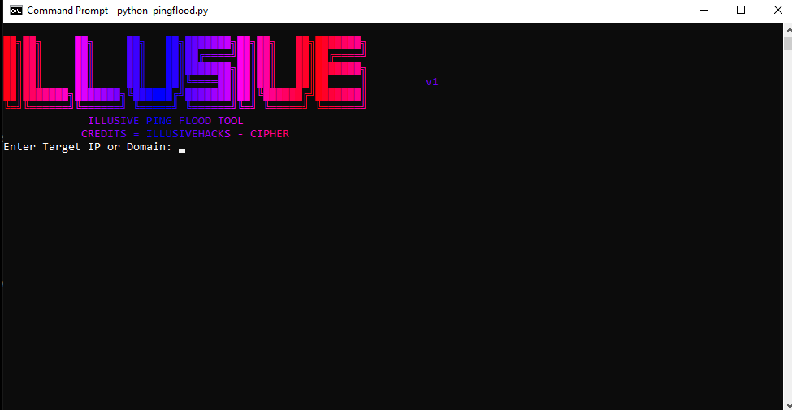
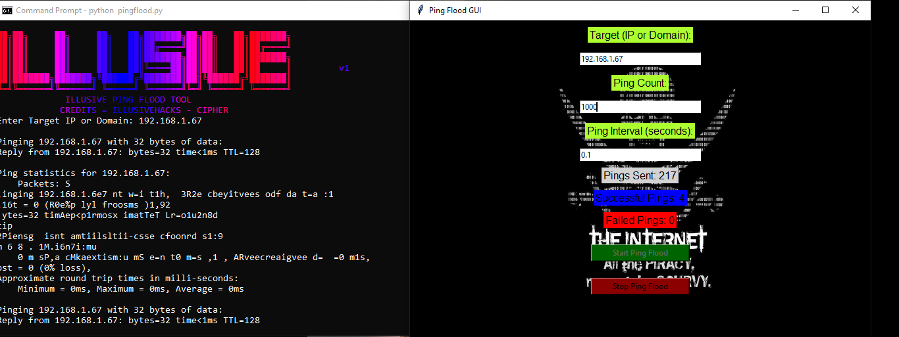

# **PING FLOOD TOOL**

🌐 Ping Flood GUI Tool

A visually captivating and feature-packed GUI tool for network responsiveness testing.
Designed to combine functionality with style, this tool helps send multiple ping requests to a target while delivering real-time updates in a sleek graphical interface.

🌟 Features
🎯 Target Customization: Input any target IP address or domain name.
📊 Real-Time Updates: Track live stats for sent, successful, and failed pings.
⚙️ Fully Configurable: Set ping count and intervals with ease.
✨ Aesthetic Interface: A stunning dynamic background paired with a user-friendly design.
🛑 Control Buttons: Start or stop the ping process at your convenience.


🛠 Getting Started
Installation Steps
Clone the Repository:

bash
````git clone https://github.com/Illusivehacks/ping-flooding.git```` 
````cd to tool directory````  

Install Required Dependencies:
bash
````pip install -r requirements.txt````  
Add the Background Image:
Ensure the 71316.png file (or any background image of your choice) is in the project directory.

Run the Tool:

bash
````python ping_flood_gui.py```` 

How to Use
Launch the application.
Enter the target IP/domain, number of pings, and interval between pings.
Click "Start Ping Flood" to begin.
View the stats in real time.
Click "Stop Ping Flood" to terminate the process.


📸 Screenshots

GUI



output


🧩 Technical Details
Core Functionality:
Sends ping requests via os.system commands and tracks success/failure counts.

GUI Framework:
Built using Tkinter, with elements styled for a clean and engaging user experience.

Real-Time Updates:
Utilizes multithreading to keep the application responsive during execution.

⚠️ Disclaimer
🔒 For Educational Use Only
This tool is intended for ethical and educational purposes. Misuse, such as targeting unauthorized systems, is strictly prohibited and may violate laws.

🌈 Why Choose This Tool?
A visually stunning interface that makes network testing enjoyable.
Ease of use with intuitive controls and settings.
Real-time data visualization for clear and immediate feedback.

🎨 Credits
Developed by IllusiveHacks - Cipher
ASCII Art by pystyle
